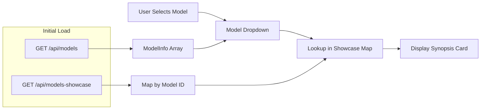

# Model Synopsis Feature

## Overview
Enhanced the model selector to display detailed information about each AI model when selected, similar to the models showcase page.

## What Changed

### 1. API Integration
- **Extended `/api/models` fetch**: Now retrieves full `ModelInfo` objects (id, name, provider)
- **Added `/api/models-showcase` fetch**: Retrieves detailed model information including:
  - Best use cases
  - Strengths
  - Limitations
  - Output specifications
  - Estimated costs
  - Specific use cases

### 2. UI Enhancement
When a model is selected from the dropdown, a beautiful gradient card appears showing:

```
┌─────────────────────────────────────────┐
│  Claude 3.5 Sonnet      [Anthropic]     │  ← Header with name & provider
├─────────────────────────────────────────┤
│  Best For:                               │
│  • Fast screenplay drafts                │
│  • Scene writing                         │
│  • Script editing                        │
│                                          │
│  ✅ Strengths:                           │
│  • Excellent speed/quality balance       │
│  • 200K context window                   │
│  • Strong analytical abilities           │
│  • Cost-effective                        │
│                                          │
│  ⚠️ Limitations:                         │
│  • Less creative than Opus               │
│  • Better for shorter pieces             │
│                                          │
│  Output: Up to 200,000 tokens            │
│                                          │
│  💰 Estimated Cost:                      │
│  $0.003 per 1K tokens (input)            │
│  $0.015 per 1K tokens (output)           │
│                                          │
│  Use Cases:                              │
│  • Short film scripts                    │
│  • Commercial scripts                    │
│  • Scene rewrites                        │
│  • Script coverage notes                 │
└─────────────────────────────────────────┘
```

### 3. Styling
- **Gradient background**: Purple gradient (667eea → 764ba2)
- **White text**: High contrast on gradient background
- **Provider badge**: Rounded badge showing model provider
- **Cost highlight**: Special styling for cost information
- **Responsive sections**: Clean, organized information layout

### 4. Fallback Behavior
For models without detailed showcase data:
- Shows model ID
- Displays a hint: "💡 Detailed information not available for this model"
- Still allows selection and usage

## User Experience

### Before Selection
```
Select Model: [Choose a model ▼]  [🔄 Refresh]
```

### After Selection
```
Select Model: [Claude 3.5 Sonnet (Anthropic) ▼]  [🔄 Refresh]

┌────────────────────────────────────┐
│   Beautiful Synopsis Card Here     │
│   (See visual example above)       │
└────────────────────────────────────┘
```

## Technical Implementation

### Files Modified
1. **src/types/api.ts**
   - Added `ShowcaseModel` interface
   - Added `ShowcaseCategory` interface
   - Added `ModelsShowcaseResponse` interface

2. **src/api/models.ts**
   - Updated `getModels()` to return `ModelInfo[]` instead of `string[]`
   - Added `getModelsShowcase()` function to fetch detailed data

3. **src/components/ModelSelector.tsx**
   - Loads both models list and showcase data in parallel
   - Displays model name + provider in dropdown options
   - Renders synopsis card when model is selected
   - Handles cases where showcase data is unavailable

4. **src/index.css**
   - Added `.model-synopsis` styles
   - Added gradient background styling
   - Added responsive section layouts
   - Added special cost highlight styling

## Data Flow



## Benefits

1. **Informed Decision Making**: Users can see exactly what each model is good for before testing
2. **Cost Awareness**: Estimated costs are shown upfront
3. **Use Case Matching**: Helps users pick the right model for their task
4. **Professional Presentation**: Beautiful gradient card design
5. **Graceful Degradation**: Works even when detailed data isn't available

## Example Models with Full Synopsis

Models with complete showcase data:
- ✅ Claude 3 Opus
- ✅ Claude 3.5 Sonnet
- ✅ GPT-4o
- ✅ GPT-4 Turbo
- ✅ Llama 3 70B Instruct

These models are categorized in:
- 📝 Script & Creative Writing
- 💰 Budget & Financial Planning
- 💼 Funding & Pitch Development
- 🎨 Marketing & Promotion

## Testing

To test locally:
```bash
cd /root/testopenrouter
npm run dev
```

1. Go to **Test Prompt** tab
2. Click the model dropdown
3. Select any model
4. See the beautiful synopsis card appear below the dropdown
5. Try different models to see different information

## Future Enhancements

Potential improvements:
- Add search/filter in model dropdown
- Show model capabilities badges (vision, function calling, etc.)
- Add "Compare Models" feature
- Cache showcase data in localStorage
- Add model performance ratings
